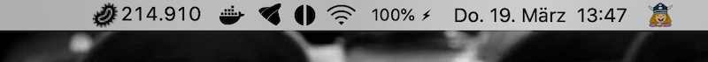
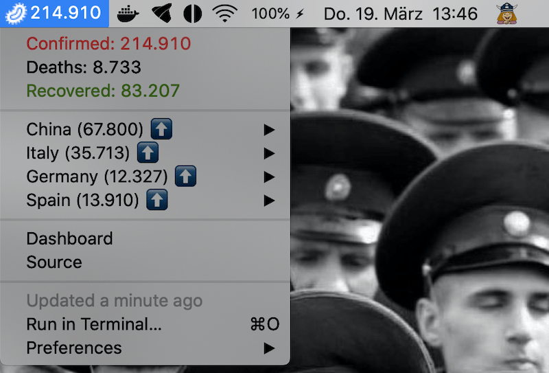
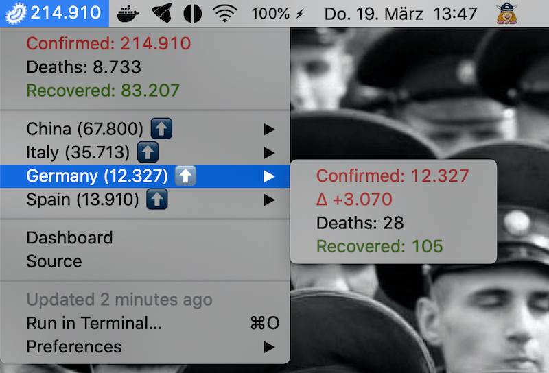

#  Bitbar COVID-19 Tracker
[Bitbar](https://bitbar.com/) Plugin to track COVID-19 cases

Data fetched from [Johns Hopkins University Center for Systems Science and Engineering (JHU CSSE)](https://systems.jhu.edu/research/public-health/ncov/) using [COVID-19 API](https://github.com/mathdroid/covid-19-api).

**[Visual Dashboard (desktop)](https://www.arcgis.com/apps/opsdashboard/index.html#/bda7594740fd40299423467b48e9ecf6)**

**[Visual Dashboard (mobile)](http://www.arcgis.com/apps/opsdashboard/index.html#/85320e2ea5424dfaaa75ae62e5c06e61)**

### How to Install
**1. Installing BitBar**

There are two ways to install BitBar on your Mac:
- Use Homebrew: ``brew cask install bitbar``
- Or download .app file directly: [Get the latest version of BitBar](https://github.com/matryer/bitbar/releases). Then copy it to your Applications folder and run it - it will ask you to (create and) select a plugins folder, do so.

**2. Saving this script**

- Download the [script](https://github.com/elalemanyo/bitbar-covid-19-tracker/blob/master/covid-tracker.1h.js) on your local machine. Make sure you place this file in the same plugin folder which you created while installing Bitbar.
- Refresh Bitbar.

### Add/Remove country
You just need to add/remove country name inside the `countries` object.

### Inspiration
[Covid-19 India Tracker](https://github.com/thelittlewonder/covid-19indiatracker)